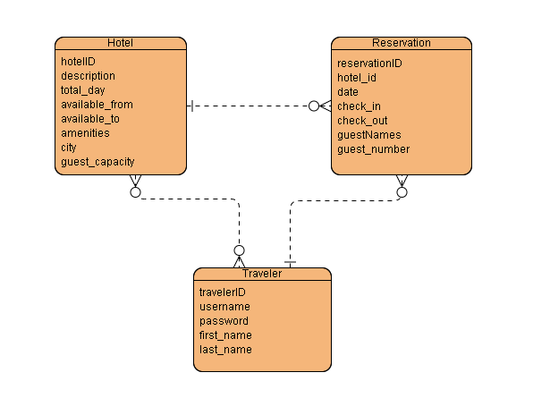

# Hotel Reservation System 

This Java-based Spring Boot project allows you to create and manage hotel reservations. The project includes basic features such as creating reservations, deleting reservations, viewing all hotels or hotel lists by filtering by certain parameters.


## Contents

- [Project Overview](#project-overview)
   - [Features](#features)
- [Requirements](#requirements)
- [Project Structure](#project-structure)
- [API Routes](#api-routes)
- [Database](#database)
   - [ER Diagram](#er-diagram)
- [Assumption](#assumption)
- [Issues](#issues)
- [Dependencies](#dependencies)


 ## Project Overview
 
Project Overview
Welcome to our Java-based Spring Boot project dedicated to hotel reservation management. This project focuses on providing a robust backend solution, offering essential functionalities for creating, modifying, and deleting hotel reservations through REST APIs. While there is no frontend interface, the system ensures seamless integration with client applications through RESTful endpoints.

#### Features
**Hotel Reservation Management**

- **Create Reservations:** Users can easily create hotel reservations by interacting with dedicated REST APIs, specifying dates and preferences.

- **Delete:** The system allows users to cancel existing reservations through RESTful endpoints.

**Hotel Listing and Filtering**
- **View All Hotels:** Clients can retrieve a comprehensive list of available hotels through RESTful APIs, obtaining a snapshot of the entire hotel inventory.

- Parameter-Based Filtering: Filtering options are available through APIs, allowing clients to narrow down hotel choices based on specific parameters like location, dates  and the number of people staying.

**Azure SQL Database Integration**
- Azure SQL Server Backend: The project leverages Azure SQL as a backend database, ensuring reliable storage and management of hotel information and reservations.


## Requirements 

- Java 17
- Lombok
- MSSQL JDBC Sürücüsü
- Swagger and Springdoc

## Project Structure

The project is structured using the Model-View-Controller (MVC) pattern, providing a clear separation of concerns and modular organization.

- **src**
  - **main**
    - **java**
      - **com.example.demo**
        - **controller**
          - [`HotelController.java`](demo2/src/main/java/com/example/demo/controller/HotelController.java)
          - [`ReservationController.java`](demo2/src/main/java/com/example/demo/controller/ReservationController.java)
        - **model**
          - [`Hotel.java`](demo2/src/main/java/com/example/demo/model/Hotel.java)
          - [`Reservation.java`](demo2/src/main/java/com/example/demo/model/Reservation.java)
          - [`Traveler.java`](demo2/src/main/java/com/example/demo/model/Traveler.java)
        - **repository**
          - [`HotelRepository.java`](demo2/src/main/java/com/example/demo/repository/HotelRepository.java)
          - [`ReservationRepository.java`](demo2/src/main/java/com/example/demo/repository/ReservationRepository.java)
        - **service**
          - [`HotelService.java`](demo2/src/main/java/com/example/demo/service/HotelService.java)
          - [`ReservationService.java`](demo2/src/main/java/com/example/demo/service/ReservationService.java)
        - [`DemoApplication.java`](demo2/src/main/java/com/example/demo/Demo2Application.java)
    - **resources**
      - [`application.properties`](demo2/src/main/resources/application.properties)
      -  [`application.yaml`](demo2/src/main/resources/application.yaml)
     


## API Routes
#### Hotel
- **Endpoint**: `GET /hotels/{pageNo}/{recordCount}`
- **Description**: Get all hotels.
  - **Response**:
    ```json
    [
      {
        "hotelID": 1,
        "description": "Merkeze yakın, konforlu",
        "amenities": "Wifi, Otopark",
        "city": "Istanbul"
      },
    ]
    ```
  - **Parameters**:
    - `pageNo` (int): Sayfa numarası
    - `recordCount` (int): Sayfa başına kayıt sayısı
   
     <br><br>

- **Endpoint**: `POST /hotels-with-parameters/{pageNo}/{recordCount}`
- **Description**: Get hotels with according parameters.
  - **Request**:
    ```json
    {
      "queryRequestDTO": {
        "date": 5,
        "fromDate": "2023-01-01",
        "toDate": "2023-01-06",
        "numberOfPeople": 2,
        "city": "Istanbul"
      },
      "pageNo": 1,
      "recordCount": 10
    }
    ```
  - **Response**:
    ```json
    [
      {
        "hotelID": 1,
        "description": "Merkeze yakın, konforlu",
        "amenities": "Wifi, Otopark",
        "city": "Istanbul"
      },
    ]


   <br><br>
      
- **Endpoint**: `DELETE /delete-hotel-by-id`

  - **Description**: Delete a hotel  by ID.

  - **Request**:
    ```json
    {
      "hotelID": 14
    }
    ```

  - **Response**:
    ```json
    {
      "status": "OK"
    }
    ```

    or

    ```json
    {
      "status": "Not Deleted"
    }

   <br><br>

#### Reservation

- **Endpoint**: `GET /reservations/{pageNo}/{recordCount}`

  - **Description**: Get a paginated list of all hotel reservations.

  - **Request**:
    - **Parameters**:
      - `pageNo` (int): Page number.
      - `recordCount` (int): Number of records per page.

  - **Response**:
    ```json
    [
      {
        "reservationID": 1,
        "hotelID": 123,
        "date": 5,
        "checkIn": "2023-01-01",
        "checkOut": "2023-01-06",
        "guestNames": "John Doe, Jane Doe",
        "guestNumber": 2
      }
    ]


 <br><br>
  
  - **Endpoint**: `GET /reservations-by-id`

  - **Description**: Get a hotel reservation by its ID.

  - **Request**:
    - **Parameters**:
      - `reservationID` (long): The ID of the reservation.

    ```json
    {
      "reservationID": 1
    }
    ```

  - **Response**:
    ```json
    {
      "reservationID": 1,
      "checkIn": "2023-01-01",
      "checkOut": "2023-01-06",
      "date": 5,
      "guestNames": "John Doe, Jane Doe"
    }

   <br><br>

   - **Endpoint**: `DELETE /delete-reservation-by-id`

  - **Description**: Delete a hotel reservation by its ID.

  - **Request**:
    - **Parameters**:
      - `hotelID` (long): The ID of the reservation to be deleted.

    ```json
    {
      "hotelID": 1
    }
    ```

  - **Response**:
    ```json
    {
      "status": "OK"
    }

    ```

    or

    ```json
    {
      "status": "Not Deleted"
    }

    
<br><br>

- **Endpoint**: `POST /make-reservation`

  - **Description**: Make a hotel reservation with the provided details.

  ```json
    {
      "hotelID": 1,
      "date": 5,
      "fromDate": "2023-01-01",
      "toDate": "2023-01-06",
      "travelerNameList": ["John Doe", "Jane Doe"]
    }
    ```

  - **Response**:
    ```json
    {
      "status": "OK"
    }
    
    ```    
    or

    ```json
    {
      "status": "Not Added"
    }
<br><br>

## Database
This project uses three main tables to store basic information about hotel reservations. Microsoft Azure uses SQL Server database.

### Hotel Table

| Column Name       | Data Type          | 
| :---:             | :---:              | 
| hotelID           | bigint (Identity)  | 
| description       | nvarchar(max)      | 
| totalDay          | int                | 
| availableFrom     | date               | 
| availableTo       | date               | 
| amenities         | nvarchar(max)      | 
| city              | nvarchar(max)      | 
| guest_capacity    | int                | 

### Reservation Table

| Column Name       | Data Type          | 
| :---:             | :---:              | 
| reservationID     | bigint (Identity)  | 
| hotelID           | bigint             | 
| date              | int                | 
| checkIn           | date               | 
| checkOut          | date               | 
| guestNames        | nvarchar(max)      | 
| guestNumber       | int                | 

### Traveler Table

| Column Name       | Data Type          | 
| :---:             | :---:              | 
| travelerID        | bigint (Identity)  | 
| username          | nvarchar(max)      | 
| password          | nvarchar(max)      | 
| firstName         | nvarchar(max)      | 
| lastName          | nvarchar(max)      | 


#### ER Diagram 
Below is a simple Entity-Relationship (ER) diagram showing the database structure of the project:




<br><br>

## Assumption
**Reservation Considerations:**

In the context of reservations, it's assumed that multiple hotels in the same city may have similar capacities and amenities.
To differentiate between these hotels, the decision was made to include the hotel ID when making a reservation.

<br><br>

## Issues
**Issue: Whitelabel Error in Swagger UI**

**Description:**

When attempting to access the Swagger UI documentation, a "Whitelabel Error Page" is encountered.  OpenAI sayesinde application.yaml da yazdığım swagger kodu sayesinde aslında endpointleri görebileceğiniz ve deneyebileceğiniz bir alan yaratıldı. Ancak anlaşılır gelmediyse Swagger'ın kendi sayfasında application.yaml dosyasının içindeki kodu kopyalayıp yapıştırarak daha iyi bir görsele sahip olabilirsiniz.


<br><br>

## Dependencies

- **Spring Boot Starter Data JPA**: Simplifies data access using JPA with Spring Data repositories.
- **Spring Boot Starter Web**: Provides essential web components for a Spring Boot application.
- **Lombok**: Reduces boilerplate code in Java classes by providing annotations.
- **Microsoft SQL Server JDBC Driver**: Allows interaction with SQL Server databases.
- **Springfox Swagger**: Generates Swagger documentation for Spring Boot applications.
- **Springdoc OpenAPI UI**: Provides an OpenAPI UI for easy API visualization and interaction.
- **javax.servlet-api**: Java Servlet API for handling HTTP requests and responses.

